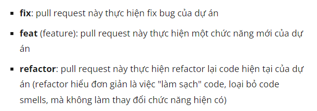

# Ứng dụng gợi ý địa điểm ăn cho sinh viên
## Git flow
####Step 1: Checkout từ nhánh dev, đặt tên theo quy tắc (action/task_name)

####Step 2: Code xong đẩy lên remote, tạo pull request merge vào nhánh dev
